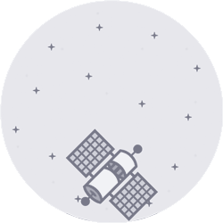
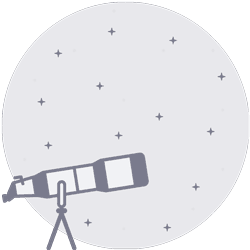

{$page.description}

### Usage

Lexicon provides different types of animation for certain purposes. We use these animations as a message support but we never use them alone without any clarification. Specific examples can be found in [dataset display](./datasetdisplay.html).

#### Empty collection

The satellite express that the dataset is empty not being anything the collection.
Use this animation when your initial dataset is empty or a folder is empty.

#### Empty search

The telescope represents the idea of looking for something in the space a nothing has been found.
Use this animation for empty search results or empty results on while applying filters over a data set. 

#### Successful empty state

The spaceship taking off represents a successful state.
Use this animation when a list has been emptied that is worthy of celebration. For example, when a notifications list gets emptied.

### Changing animations

Changing animations is possible. This is just the set of animations that Lexicon provides for Liferay products. Your business may have its own needs and this is one of the points where your brand can have an impact by customizing the animations. Our advice is to choose a theme and create a story behind it. In our case, we have bet for a space theme, an we have created several animated scenes to support our messages.
