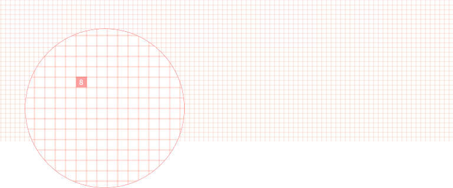

### Introduction

The aim of the Lexicon layout framework is to provide a common structural reference that contributes to streamlining the component construction and page composition processes as well as favoring visual consistency between the different elements of the interface.

### Base Grid

The Base Grid is the main metric reference of our system from which the rest of the layout structures are built. It is at the same time the starting point when defining the dimensions, paddings and margins of the elements of the interface.

This grid is constructed from a base 8px module, so that both the dimensions of the elements and the distances between them will always be multiples of 8; 16, 24, 32, 40, 48 …

  

In this way we provide a common metric pattern that contributes to create visual coherence and consistency between the different elements of the system and their spatial relationships.

The use of this reference grid favors an efficient workflow, reducing the number of design decisions as well as improving communication between designers and developers.

Establishing a minimum metric unit that is not too small can help us limit the chances of distorting the visual consistency and taking advantage of its other benefits. However there will always be specific situations in which it is convenient to work with values ​​smaller than 8px. In these cases, the system also provides a downward scaling allowing the use of the 4px unit.

Either way, values ​​less than 8 px will be primarily associated with the anatomy of the interface's basic elements rather than the specification of distances between elements and page composition. Making use of the terminology proposed by atomic design, these minimum measures would be used almost exclusively to define the internal anatomy of elements like atoms or molecules. Taking care at all times that the block that forms the element fits the base grid of 8 px. 

As for example the molecule formed by a label and a text input, or the one formed by a label, an input an a helper text.

  

To know a little more about the grid of 8 px we recommend checking some of the articles that have served as reference and inspiration for us to adopt this pattern.

* [8pt Grid](https://spec.fm/specifics/8-pt-grid)
* [Intro to The 8-Point Grid System](https://builttoadapt.io/intro-to-the-8-point-grid-system-d2573cde8632)

### Column System

The column system is the main structural pattern when organizing and arranging elements on page horizontally.

It is not so much a reference to establish the distances between small elements like the different icons or buttons that can coexist in a toolbar for example. It is more a layout framework oriented to organize and establish divisions between medium and large blocks of content.

The Lexicon system is a 12 column structure based on the Bootstrap CSS Grid, where we introduce a change in the value of the gutter to fit our base grid. In this case the gutter would be 24px. A value that we find repeated in other basic structural references of the system.

The columns behave in a fluid manner, so that their width will always be a relative value that varies depending on the size of their parent container. The gutter is the only value that remains fixed when the viewport resizes.

### Vertical Rhythm

The grid base of 8 px is also established as baseline in order to set the distances between elements at vertical level. 

But when defining the vertical spacing between paragraphs of text and elements or groups of elements that somehow configure medium and large size structural blocks is better to have a greater value as a reference. Taking the name from bootstrap variables, we call it “spacer-y”.

To set this value, we will refer to the line height of the main system font style; 24px. With this reference we seek to establish a pattern that helps to avoid the dance of measures and favors the consistency in the vertical rhythm.

For small viewports, we can make adjustments with the aim of optimizing vertical space but always respecting the base grid. Normally in these cases we use the 16px spacer-y as we do for the gutter between columns and the lateral space of the container.

It is understood that this metric pattern does not solve the vertical space needs of all possible cases. Either way it is established as a starting point on which to make timely adjustments when necessary.

### Containers

Lexicon provides two types. A  fixed width container and a fluid container with relative width.

#### Fluid container

The width of this container is adjusted fluidly according to the size of the viewport.

#### Fixed width container

This container is defined by a value of maximum width. This value is adjusted to the sizes of the different viewports according to predefined breakpoints.

### Breakpoint table

In this table you can visualize all the variations of the layout system values according to the different breakpoints.

| Breakpoint | Device Size | Container Width |
| ---------- | ----------- | ------------------- |
| < 576px | Extra small devices (Portrait phones) | Auto |
| &ge; 576px | Small devices (Landscape phones) | Auto |
| &ge; 768px | Medium devices (Tablets) | Auto |
| &ge; 992px | Large devices (Desktops) | Auto |
| &ge; 1280px | Extra large devices (Large desktops) | 1248px |
