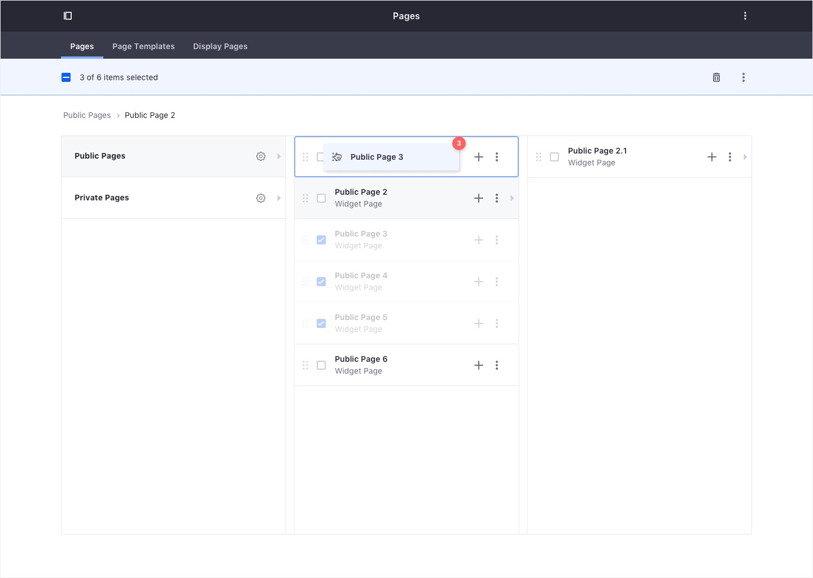

    
        
            
        
    
    
        
Juan Antón

        
UX Designer, Madrid

    

Organizing pages for a site can be hard to carry tasks. Sites can have thousands of pages and solutions like a page tree can go under performance issues due to the amount of information to load in the screen.

Moving to a Miller Columns approach let us build a hierarchy in a different way but still easy to understand as a page tree is. This model is very common for Mac users and it is prooved that is easy to learn. This pattern allows people moving pages in an easy way by drag and dropping them to different levels or on top of pages. It also provides easy ways to reorder the pages.

