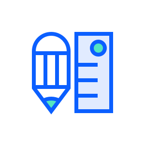
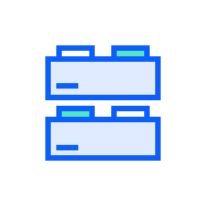
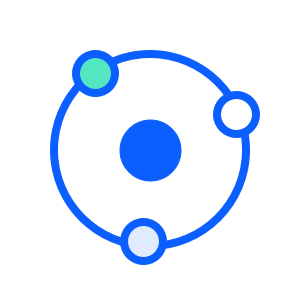
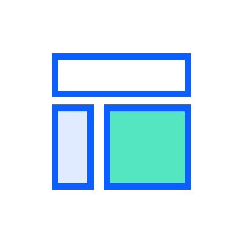
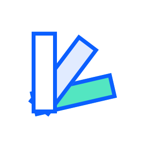

### 设计语言

Lexicon是一种设计语言，它为在Liferay产品生态系统中构建界面提供了一个通用框架。它是一个基础、组件、模式和用例的指南，为这些产品提供一致性和连贯性的，并最终为用户提供满意和统一的体验。

Lexicon是一个充满生命力的项目，随着时间的推移不断发展和适应新兴技术，以满足人们的需求。

### 模块化方法

Lexicon采用了模块化方法进行界面设计。它是一个内聚性的系统，能够通过一组基础组件响应Liferay产品的各种需求。旨在简化流程，减少生产时间，最重要的是，提供全面一致的用户体验。

为了实现这一目标，Lexicon使用了Brad Frost的原子设计方法来进行界面设计：一种基于模块化的工作方法，旨在为界面设计系统的创建提供更加分层和有组织的结构。这是一个非线性的过程，由五个阶段组成：原子、分子、有机体、模板和页面。

### Lexicon网站

本网站为设计人员、开发人员和整体数字创造者解释了Lexicon组件系统的设计规范和使用场景。虽然Lexicon主要面向Liferay社区，但Lexicon对于任何想要使用它的组件，或为改进它做出贡献或建议的人都是开放的。

    
        
    
    
        <h4>基础</h4>
        
设计系统所依据的原则。对这些原则的修改会影响组件的行为。这些原则包括了基础元素，如颜色、网格和排版等。

    

    
        
    
    
        <h4>核心组件</h4>
        
包含了构建界面所必需的常用组件。每个组件定义了它的规则和行为。每个组件的外观和风格都基于上述基础的组合。因此，对基础原则的修改会传播到整个系统。在我们的例子中，这些组件是由[Clay](https://clayui.com/)实现的。

    

    
        
    
    
        <h4>卫星组件</h4>
        
卫星组件可满足特定产品或应用的需求。它们是使用Lexicon的基础和核心组件构建的。它们属于创建它们的产品或应用程序，而不是设计系统本身。

    

    
        
    
    
        <h4>模版</h4>
        
模板提供了预先构建的解决方案，以解决重复界面的挑战。它们加快了设计过程，因为只需要较小的修改即可适应您的用例并显示您的内容。

    

    
        
    
    
        <h4>示例</h4>
        
本节展示了UX设计师的实际设计，演示了如何应用核心组件和卫星组件来创建解决特定场景的Lexicon界面。

    

此站点中的组件包括如下所示的标签，这些标签表示组件是否链接到其实现或您可以找到它们的产品。这允许您在实际应用程序和上下文中查看组件。

| 标签 | 应用场景 |
| ---- | ----- |
| <a class="label-link label label-warning" href="https://clayui.com/" target="_blank">在CLAY中查看</a> | 指向模式实现的链接 |
| 产品名称 | 该模式用于具体产品或应用中 |
| 待处理 | 该模式已被设计并将在Clay或产品/应用程序中实现 |

### 实现Lexicon

 Lexicon不是一种实现。它是任何库都可以实现的一组模式、规则和行为。Liferay的Lexicon体验语言的web实现是[Clay](https://clayui.com/)。
