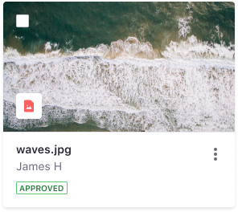

## Badges

### Description

Badges help highlight important information such as notifications or new and unread messages. Badges have circular borders and are only used to specify a number.

### Usage

* Badges can be of different types as it can be seen in the previous image. Apply them properly depending on the context. You won't always need a badge to identify a number, in those cases plain text is an option to take into account.
* Badges are used only for integers. 
* Badges can not be close or link to another a page. They are only used as informative text.
* Badges are not thought to always indicate the exact number of elements. In that case please use plain text. Badges work for exact numbers up to 999. From there we use K from Thousands (5K for 5.231) , M for Millions (2M for 2.100.523).
* Red background color badge is only dedicated to notifications. Any other kind of counter in the system must have another color.
* In case you need a pattern where to write non-numeric values, labels is the pattern to use.

### Attributes

* Height: 16px (total 20px)
* Border: 2px
* Font-size: 12

## Labels

### Description

Labels are a mechanism to categorize information providing quick recognition.

### Usage
Use labels to organize groups of items in your application. Labels have rounded borders by default.

### Sizes

| Size | Usage |
| ---- | ----- |
|  | **Small**: Use it in contexts where its relevante is not major. Use it always in capital letters. Mar |
|  | **Default**: Use it for marking states. The use of lowercase is valid in this option|

### Variations

#### Label simple

Used to identify, tag contente, show status, to filter content or even to provide navigation to elements of same identification. It can be used with status colors.

#### Label removable

Used in filter bars, categories, etc. Always in default size and without status color. Use it only in default size.

#### Label with link

Used in sites to link to related content.

### Attributes

* Small size
	* Height: 16px
	* Border: 2px
	* Line-height: 14px
	* Font-size: 10
	* Padding: 0px 6px 0px 6px 
* Default size
	* Height: 24px
	* Border: 2px
	* Line-height: 16px
	* Font-size: 12
	* Padding: 4px 8px 4px 8px 

## Stickers

### Description

Stickers are a visual way to quickly identify content in a different way than badges and labels.

### Usage
Use stickers to visually identify elements in a dataset that are part of a same group. You can use any color you want for stickers.

### Sizes

| Sticker Size | Icon Size | Usage |
| ------------ | --------- | ----- |
| 24px | 12px | Use it in smaller contexts where you only need visual identification but not manual interaction with this element. |
| 32px | 16px | Use it in cards that are image based, allowing to see more parts of the image. |
| 40px | 20px | Use it in sites to identify the user in a comment in comments portlet. Only rounded.|
| 48px | 24px | Use it in sites to identify the user in a blog entry or article. Only rounded.|

### Variations

#### Square

Use it only with files and folders. You can place up to 3 characters inside it or an icon. Always capital letters.

#### Round

Use it only with people. You can places up to 2 characters inside it or an image. Always capital letters.

#### Squared with badge

Use it only in FARO. While the squared area with icon can change the background color, the small circle must remain in priamry blue color.

### Position
A sticker can be placed in a Image Card. Its position is always bottm left as you can see in the following example.

