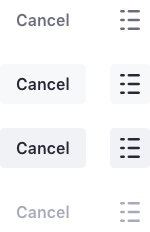
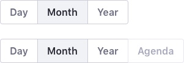

<a class="label-link label label-warning" href="https://clayui.com/docs/components/buttons.html" target="_blank">CLAY</a>

### Description

{$page.description}

### Types

| Type | Usage |
| ---- | ----- |
|  | **Primary**: The primary button is always use for the most important actions. There can't be two primary actions together or near by. |
|  | **Secondary**: The secondary button is always use for the secondary actions. There can be several secondary actions near by. |
|  | **Link**: Used for many Cancel actions. |

### States

#### Default state

#### Hover state

#### Active state

#### Disable state

### Sizes

| Size | Usage |
| ---- | ----- |
|  | **Default**: Used for main page actions like Save or Cancel. 40px height. |
|  | **Small**: Used for actions inside a page, like dropdowns, button groups, split buttons. 32px height. |

### Variations

#### Secondary borderless

Secondary borderless button is meant to be used in those cases as toolbars where the secondary button would be too heavy for the pattern design. In this way the design gets cleaner.

#### Icon button

Buttons can icons instead of text and for that icons need to be monospaced inside the button. Lexicon do not use buttons with text and icon, or text and loading indicator. Icon buttons are used intensively in [management bars](./management_bar.html). This button variation can be primary, secondary or borderless type.

  

#### Icon and text button

This button type is used *only in sites* and not in administration. The icon emphasizes and helps to understand the action. The label must be the same icon purpose.

#### Block level button

All buttons can also be configured at block level. Use this configuration in those cases that you need the user to realize there is an important action to be done. It could be used as a load more action below a list, as an example. Please do not use it in forms. Be always careful with the type button to use, primary is not always the best choice neither the only configuration.

#### Dropdown button

Dropdown buttons are always used together with a dropdown menu. This button variation can be secondary or borderless type.

  

#### Split button

Split buttons are used in those cases where you need to offer the user a quick main action but also secondary actions.

#### Button group

Button groups are used to switch between complementary views for example, but they must never be used for complementary actions and "Change and Cancel" or "Save and Cancel". In those cases the use of single buttons is the correct solution.

#### Plus button

Normally placed in toolbars, allows to have adding actions over a dataset. The kind of elements to add with this button are of the same nature and folders. Sometimes it only has a unique action, some others it has more. Visit Dropdown menu > Sorting actions to know more.

#### Action button

It is used when a set of contextual actions are needed over an element or a dataset. This button displays a set of actions inside a dropdown menu. The actions must be sorted in an specific way, please visit Dropdown menu > Sorting actions to know more.

  
