
{$page.description}

### Usage
Dropdowns are used to list a set of options that are not easy to manage in the screen. This mechanism helps to clean-up the screen making everything more implicit.

Dropdowns are usually triggered from a dropdown button or a button with icon, as the actions button. These are the two most extended cases in Lexicon.

Closing a dropdown can be done by:
* Selecting an option in the panel, if they are mutually exclusive.
* Clicking on the button that triggered it.
* Clicking outside the panel.

A dropdown menu can contain any kind of basic form component / element like text field, list of options, list of options with radios, list of options with checkboxes, or button.

Dropdowns have a maximum width of 240px. When an entry text doesn't fit into the available space, use 2 lines. The text in each entry should be short and specific enough to not use more than one line.

Maximum height is established in 600px for desktop and 400px in mobile. Vertical scroll is allowed when the content exceeds the limit.

The distance from the button to the dropdown is 8px.

### Types

#### Default

The default dropdown is just a panel not prepared for scrolling the content inside it. Use this type when the number of options you want to offer is short or the panel is big enough to contain all the elements you want to use.

 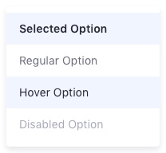

#### Dropdown with dividers

Dropdown menu with dividers are thought to be used in actions menus. Dividing the actions by context of use help users to find actions.

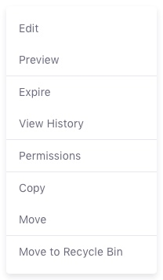

#### Dropdown with checkbox or radio

Dropdowns can be configured to have checkboxes and/or radio groups. A checkbox configuration can be suitable to filter in or out dataset elements. While, a radio configuration can be suitable to establish the order criteria in a dataset.

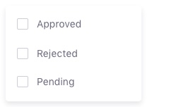 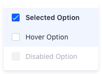

#### Dropdown with search field

Sometimes action menus face problems with the number of elements they contain. This dropdown menu variation helps in those contexts where the set of options is large and a search mechanism helps to reduce the search time and task complexity.

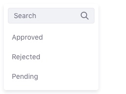 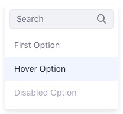

#### Dropdown with left icons

Dropdown menus with left icons are suitable for process bars (wizards) where there is a need to display a dropdown menu when the number of steps do not fit the screen.

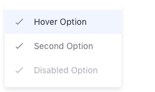

#### Dropdown with right icons

Dropdown menus with left icons are suitable for process bars (wizards) where there is a need to display a dropdown menu when the number of steps do not fit the screen. In this case, the step number has a high relevance, therefore the icon is placed on the right side.

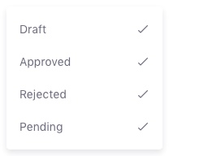 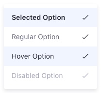

#### Dropdown with groups

This dropdown menu variation is created to be used with the management bar Filter and Order dropdown button. This configuration is thought to clean the management bar providing the user with more specific mechanisms to find data. 

The button in a dropdown menu can be either primary or secondary depending on the application needs.

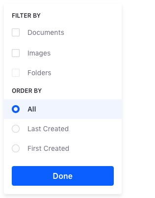 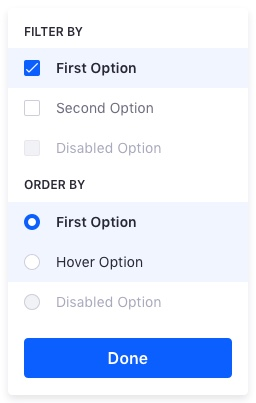

### Sorting actions

#### Dropdown menu from actions button

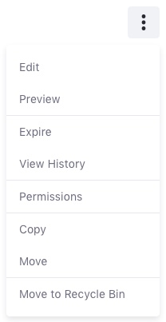

Guideline: (not all steps are always in use)

1. Order by context (use a separator line between each of the groups):
	- Primary commands: edit, preview, open…
	- Secondary commands specific of the object: expire, view history
	- Transfer commands: copy, duplicate, move, export, import
	- Object settings: permissions, configuration
	- Object commands: delete, move to the recycle bin
2. General rules
	- Group size must be less or equal than 7.
	- The total number of elements must not exceed 15 items.
	- Use separator lines between groups.
	- Do not increase the menu complexity with submenus.
3. Order inside a group must be use frequency, in other case use alphabetic order.
4. Disabling actions:
	- Do never remove actions. If an action is not available for an item due to its state, disable it.
	- Exception: remove the action if the item by its nature cannot perform the action.
5. Actions menu actions don’t have icons. Using many icons can increase the reading time of the menu.
6. Complementary actions must together (Ex: Lock, Unlock)
	- When one is able the complementary must be disabled.
	- Sometimes both would be able at same time (undo / redo)
7. Only present the actions that make sense in the context. Do not overload the menu. This doesn't mean to remove disabled items.

#### Dropdown menu from Plus button

Sometimes the plus button use in certain contexts need more than a single action. For those cases please follow the following set of rules:

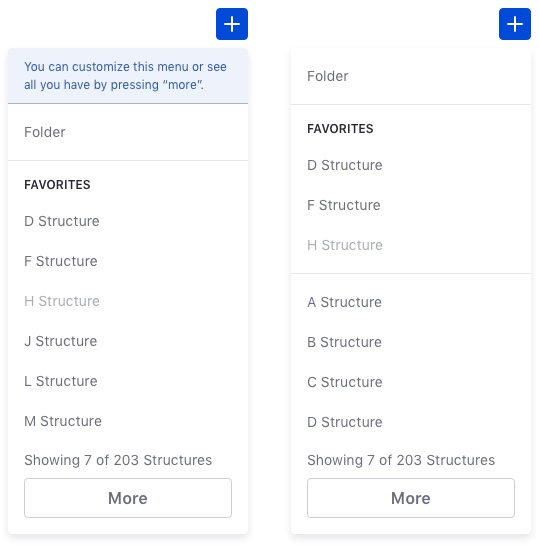

The left configuration suggest the user the possibility of having favorites elements. Favorites are selected in a modal window and the outcome is reflected as in the right image.

Out of the favorites the order is ruled as follows:
* First two elements are the most used ones.
* The rest are displayed in alphabetical order

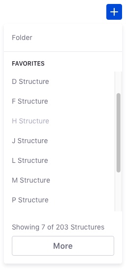

The previous image shows a case with scrollbar to let your understand the scrollable area.

Guideline:

1. The menu must be splitted in 2 areas:
	- Primary actions: always contain the generic actions. Example: folder.
	- Secondary actions: are sets of actions that attend a certain category, for example: structures, document types…
2. Secondary organization:
	- Make a first group of favorites in case they exist.
	- Make a second group with the rest of actions.
	- Display a maximum of 7 actions between favorites and not favorites.
	- Show a message to allow the user know the total number of actions inside the category. Example: “Showing 7 of 203 items”
	- Include a More area to give access to the modal that contains the rest and the configuration of favorites.
3. Sorting inside each group:
	- Place first the most used
	- Place the rest in alphabetical order.
4. The limit of this dropdown menu is 15 actions.

### Attributes

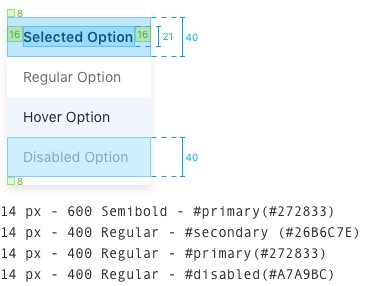

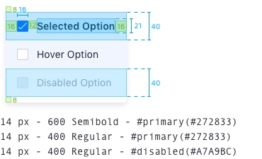
