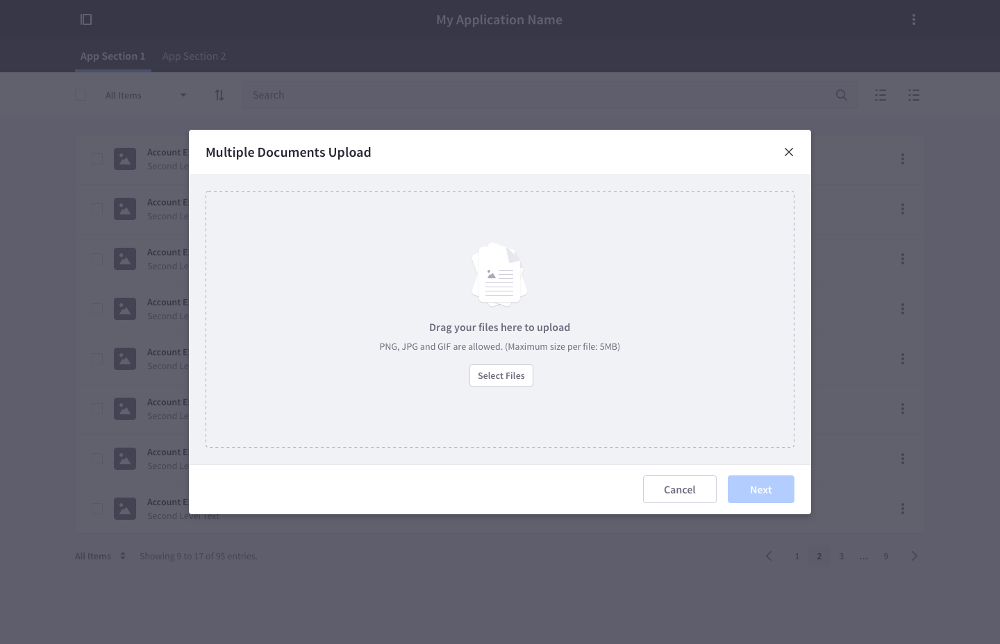
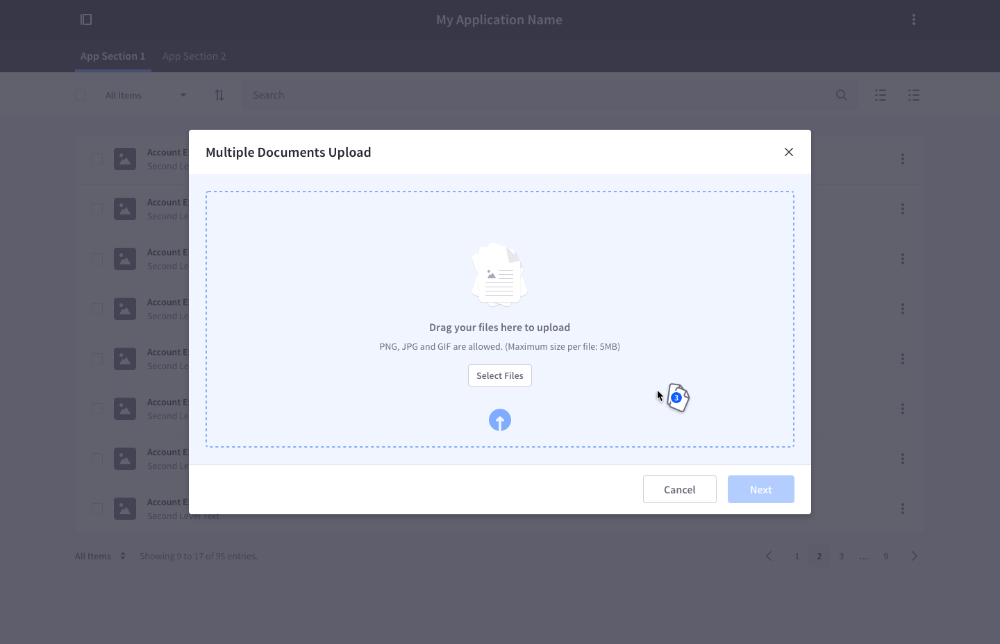
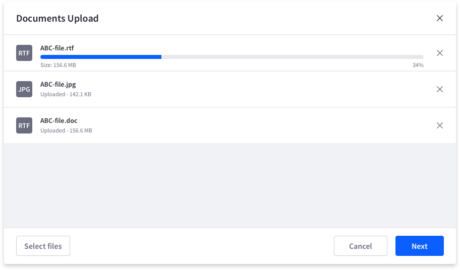
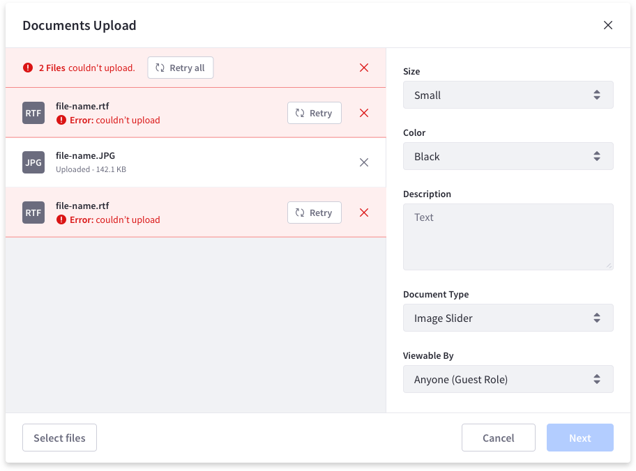
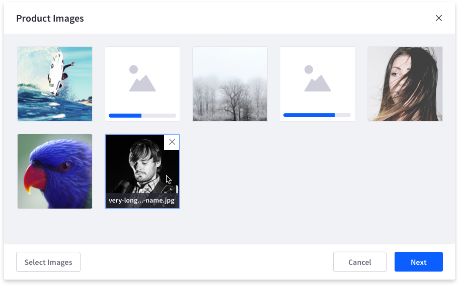
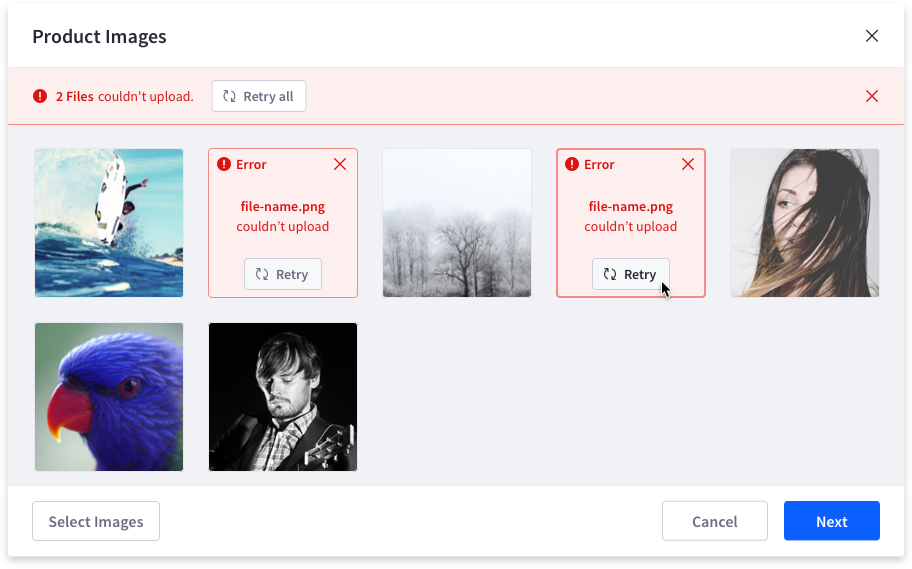

### Description

{$page.description}

### Simple file upload
Simple file upload is used to upload a simple file element.

### Multiple file upload
Inside this categorization we have two different patterns: file uploader and image uploader. Both are pretty similar but the second one is more visual and adapted to the situation.

Both uploders share the same **upload area** which works in the following way:
* It must always have 2 different states:
    * Default
        * Message: to clarify file extension permitted, max size of each file.
        * Secondary button: as not always users would want to user the drag and drop feature. The button opens the operating system file uploader with the possibility of selecting multiple files.

        

    * Active
        * It contains an animation that invites users to drop documents on dropover state.

        

* Once files have been added to the upload system, there must be always clear options to upload more files, explicit button and drag and drop option.
* The scroll must be only vertical if needed.
* Each file can be deleted individually.
* Each file can retry the upload individually

#### File uploader

* File uploader admits any kind of file further that images as it can be pdfs, docs, etc.
* After dropping files in the area, a list with the upload status is displayed allowing the users to see the upload status of each single file.
* Files that didn't complete the upload process provide the option to retry the upload.
* Every file must be always possible to be removed.

In this example the file uploader counts with a form to predefine a certain configuration for the files uploaded.

Files can be in different states:

* Default state: when the file is already uploaded

* Upload state: while the is the upload process

* Error state: the file upload has failed

#### Image uploader

* Image uploader only admits image file types.
* After dropping images in the area, a images grid appears allowing the user see the upload process.
* The drag and drop area hots the image grid. This are must have a vertical scroll. The cell next to last uploaded image must have a "+" to invite the user to upload more files. Clicking in that cell opens the file upload for the specified files.
* Each images is represented by its squared thumbnail.
* Images that didn't complete the upload process provide the option to retry the upload.
* Every image must be always possible to be removed.

Images can be in different states:

* Upload state: while the is the upload process. Left side default state, right side hover state.

* Error state: the file upload has failed

* Default and hover image states: when the file is already uploaded

* It can be the case that the image uploader requires of checkboxes for a specific requirement

