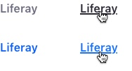
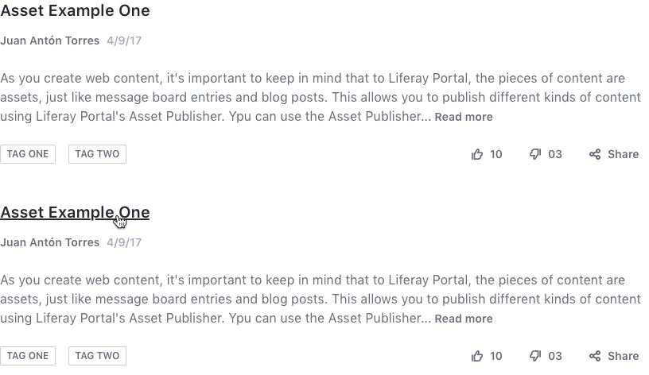
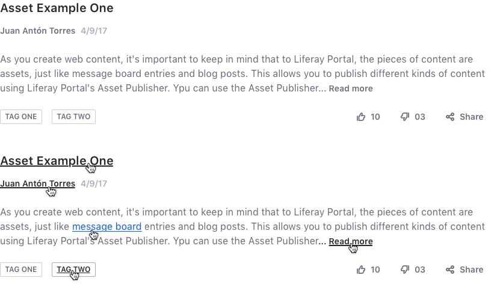

{$page.description}

### Usage
* Use links only for navigation. A link must not trigger other kind of action.
* Do not use a link to trigger an action that could trigger a button. If this is the case use [button link](./buttons.html) type.

### Types

#### Inline Link

Use an inline link text element inside of a text sentence or paragraph. A inline link element flows with other text elements.

Attributes:
* Color: primary blue
* Font weight: inherit
* Hover: primary blue hover color + underline

#### Single Link

Used for stand-alone hyperlinks. Can be a text or an image.

Attributes:
* Primary Text Alone Link
	* Color: primary blue
	* Font weight: semibold
	* Hover: primary blue darken 5% color + underline
* Secondary Text Alone Link
	* Color: secondary gray
	* Font weight: semibold
	* Hover: primary gray color + underline
* Image
	* No style

#### Title Link

Used for links associated to list item titles like Dataset Display (stacked list, table or cards), asset title, blog entry teaser title …

Example 1:

Example 2:

Example 3:

Attributes:
* Color: inherit
* Font weight: inherit
* Hover: underline

As a summary and to see all acting at same time:

#### External Link

For hyperlinks that point at (target) any domain other than the domain the link exists on (source) we provide a tooltip specifying this behavior.

For accessibility purposes we also provide an icon to illustrate this behavior. This icon is visually hidden by default and only accessible on focus or when using assistive technologies such as screen readers.

