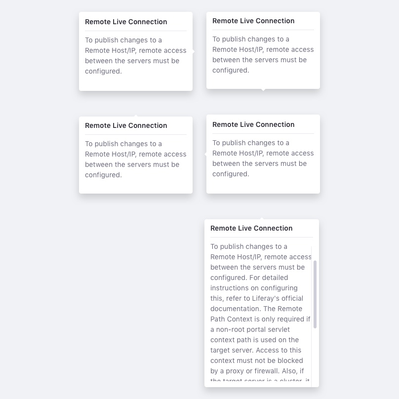
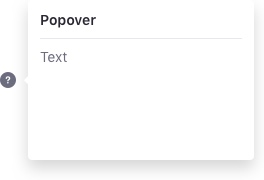
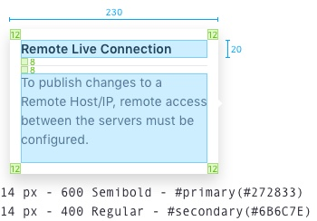
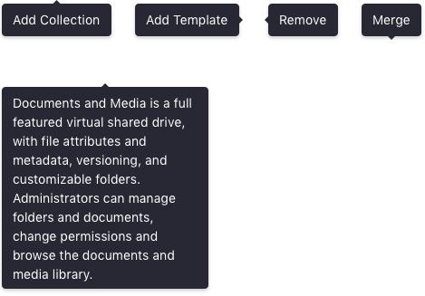

{$page.description}

## Popovers

 

### Usage

Popovers are used together with the question mark icon as an affordance to let the user understand there is something to read that can be useful. Popovers contain information such as help to understand a context.

#### Do's and Don'ts

Keep a distance of 8px between a text and the icon so it is easy to recognize and associate.

	

        
        
Do

	

	

		
		
Don't

	

Similar to the previous case happens with sections, in this case the distance is 16px.

    

        
        
Do

    

    

        
        
Don't

    

### Attributes

## Tooltips

Tooltips are brief pieces of information that appear on hover state over an element to clarify the meaning or use of an interaction element for the user.

### Usage

* Tooltips are used with icon buttons to help understanding the metaphor they transmit.
* They can be also used with links or images.
* Tooltips are thought to contain few text. Lexicon recommends a maximum of 280 characters. In case your description is longer, please use a popover.
* The tooltip appears on hover state and disappears when hover ends. This pattern does not exist in mobile a hover is not a possible state.
* Please make a right use of the arrow positioning as it could drive to misunderstandings when it doesn’t point to the correct interface element.
* When possible, try to not overlap other interaction elements in the same component.

#### Do's and Don'ts

Use tooltips on elements that have an action behind as button icons.

	

        
        
Do

	

	

		
		
Don't

	

### Attributes

